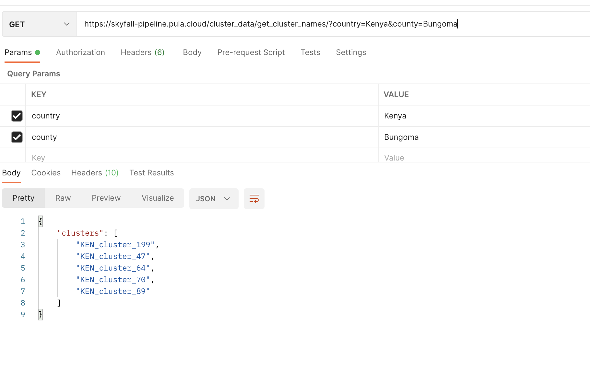
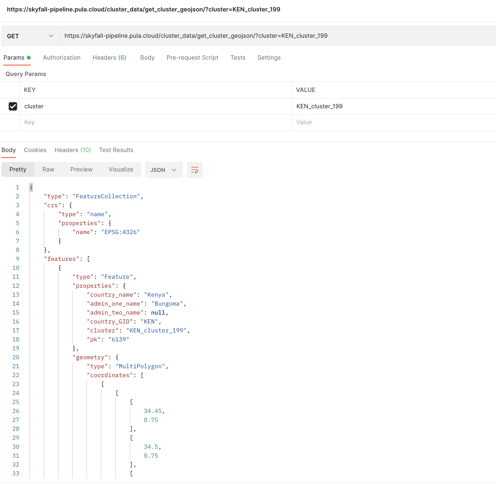

#####################################
API usage Administrative layers query
#####################################

Hi there this Section of the documentation is to help us understand how to make requests to this API.

base url **https://skyfall-pipeline.pula.cloud/** or use the ip **http://208.85.21.253:8100/** 

Getting Admistration level Data
-------------------------------
*Admistration or administrative boundaries are layers we are using to map diffirent places 
they are basically shapefiles or feature collection and vary according to the levels*

* Admistration level zero (0)

This the country level dataset 
    a. Country list 
    Returns list of countries available in the system by querying;

    ``https://skyfall-pipeline.pula.cloud/AdminData/get_adm0_data/?country_names=ALL``

    .. figure:: ../Images/countries.png
       :alt: API request for country names 
    
    b. Projects information

    Each country available may have projects differing in the sence of crop calenda and covrage,
    this api returns the projects available for a respective country, remember the country name has to be from the,
    country list api.

    ``https://skyfall-pipeline.pula.cloud/CropCalenderApi/get_projects/?country=Pakistan``

    .. figure:: ../Images/projects.png
       :alt: API request for project names in a country

    c. clusters information

    clusters are what may be considered unit of insurance, they are usually created to simulate or,
    represent areas with homegenearity in terms of climate, soils and topography. to get list of names of clusters 
    in a country query the api as follows.

    ``https://skyfall-pipeline.pula.cloud/cluster_data/get_cluster_names/?country=Kenya``

    *Please Note in the current version of skyfall backend some counties may not have the clusters thus analysis is,
    done using the lower administrative boundary(s). In such a case the api may return an json with an empty list*

     .. figure:: ../Images/clusters_country.png
       :alt: API request for project names in a country

* Admistration level one (1)

This is the first level of administrative boundary for diffirent locations (*Jurisdiction*) 
the name varies in the case of Kenya they are refered to as Counties. 

    a. Counties list 
    
This county list is what the list of counties available for that country this is provided for from the back end by looping 
through the field in the database that contains the names.

That information is queried as follows 

``https://skyfall-pipeline.pula.cloud/AdminData/get_adm1_shapefile/?county_names=ALL&country_name=Kenya``

The response is a json object with key **counties** and item is an **array** containing the names of the counties

.. figure:: ../Images/Admin1names.png
   :alt: API request for county names 

API request for county names

    b. County dataset

This api request returns the actual Geojson file given the county name 

Note **the name has to be in the array since the data is a query to the database.** It returns a feature collection

County Geojson is queried as follows:

``https://skyfall-pipeline.pula.cloud/AdminData/get_adm1_shapefile/?Get_county=Kisumu``

    .. figure:: ../Images/AdminGeojson1.png
       :alt: API request for county feature collection

`` Get_county=`` the name of the county is placed after the **=** sign

    c. Cluster dataset

One can query cluster names that fall within a county as follows;

``https://skyfall-pipeline.pula.cloud/cluster_data/get_cluster_names/?country=Kenya&county=Bungoma``

* Admistration level two (2)

*Administrative level two in the Kenya context means the sub-counties or constituencies*

*There are the second leve of administrative boundary a number of administrative level two, forms a county*

    a. Sub-county list (admin 2)

The query is made giving a county name; the api returns list of names sub-counties (admin 2) within a county, the names recieved from Admin1names are used to query for the names for the
sub-counties 

county_name field of the ADM2DATA is filter and an iteration is done to the field of sub_county_names to get the names

**The Query is done as follows**
``https://skyfall-pipeline.pula.cloud/AdminData/get_adm2_shapefile/?Get_sub_counties_names=Nairobi``

.. figure:: ../Images/Admin2names.png
   :alt: API request for admin2 names 

API request for admin2 names

    b. Sub-County (admin2) dataset

This api request returns the actual Geojson file given the admin2 name 

Note **the name has to be in the array of sub_county_names since the data is a query to the database.** It returns a feature collection

**Admin 2 Geojson is queried as follows:**

``https://skyfall-pipeline.pula.cloud/AdminData/get_adm2_shapefile/?sub_county=Mogotio``

``sub_county=`` the name of the sub_county is placed after the **=** sign

.. figure:: ../Images/Admin2Geojson.png
   :alt: API request for sub_county feature collection

API request for sub_county feature collection

* Admistration level three (3)

*Administrative level three in the Kenya context means the wards*

*This is the third administrative boundary*

    a. Wards list (admin 3)

The query is made giving a sub-county name; the api returns list of names wards (admin 3) within a sub-county, 
the names recieved from Admin2names are used to query for the names for the wards 

sub_county_name field of the ADM3DATA is filtered and an iteration is done to the field of ward_names to get the names

**The Query is done as follows**
``https://skyfall-pipeline.pula.cloud/AdminData/get_adm3_shapefile/?Get_wards_in_sub_county=Mogotio``

.. figure:: ../Images/Admin3names.png
   :alt: API request for admin3 names 

API request for admin3 names

    b. ward (admin3) dataset

This api request returns the actual Geojson file given the admin3 name 

Note **the name has to be in the array of ward names since the data is a query to the database.** It returns a feature collection

**Admin 3 Geojson is queried as follows:**

``https://skyfall-pipeline.pula.cloud/AdminData/get_adm3_shapefile/?GetWardGeojson=Emining``

``ward=`` the name of the ward is placed after the **=** sign

.. figure:: ../Images/Admin3Geojson.png
   :alt: API request for ward feature collection

API request for ward feature collection

* Unit Area of Insurance (UAI) (4)

As detailed earlier UAI are used to do analysis for crop insurance puporses in the context of `PULA`_ 

Details on how to access the respective cluster names in a country, county and in some instances sub-county have been
provided earlier in previous sections. This sub-section shows how to access the geojson for the clusters for visualization and other purposes.

**UAI/Cluster 3 Geojson is queried as follows:**

``https://skyfall-pipeline.pula.cloud/cluster_data/get_cluster_geojson/?cluster=KEN_cluster_199``

.. _PULA: https://www.pula-advisors.com/

