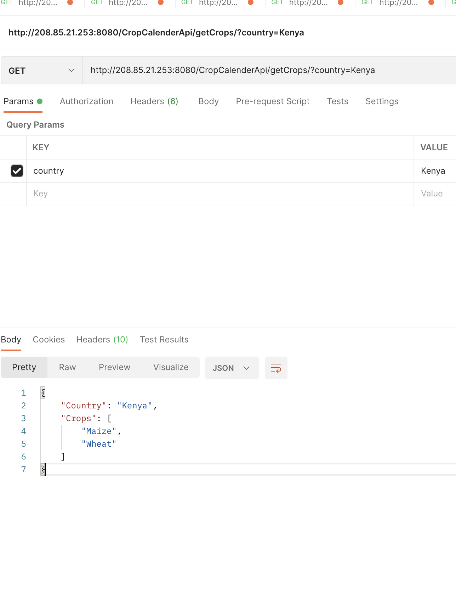
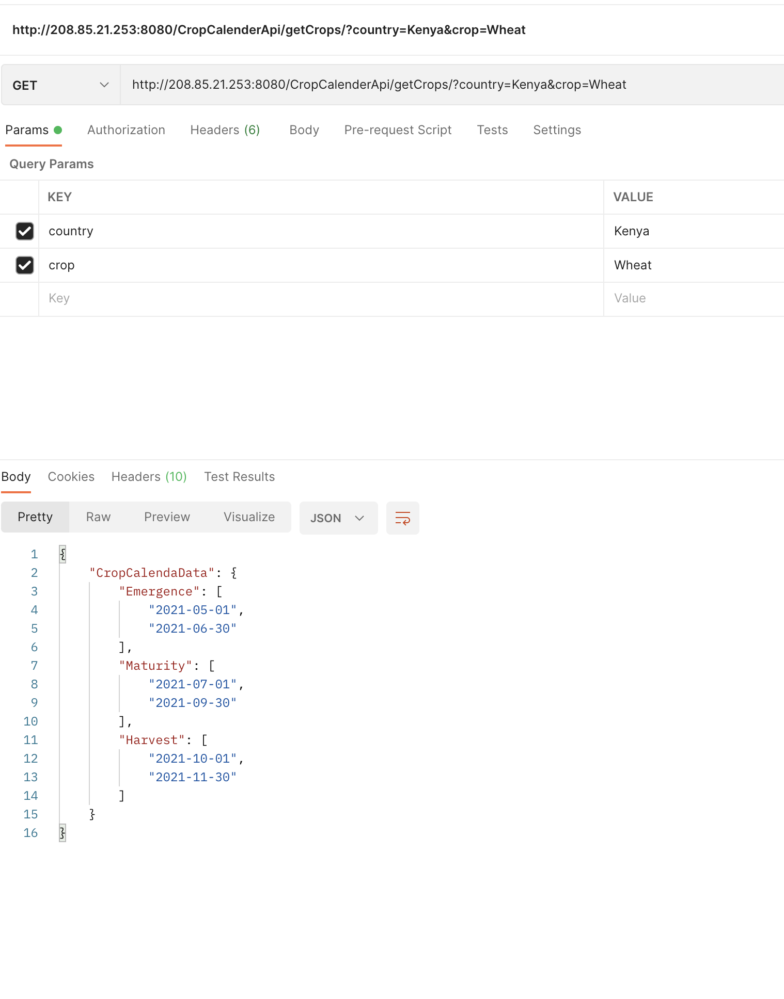

########################
Crop Calenda information 
########################

Overview 
--------

Crop calenda information is vital in the sense that it helps us track the crop growth cycle
in turn assess the vegetation status in terms of whether or not the crop is performing well.

A model was built in the backend to store this information, to help in automation of the process of crop 
performance evaluation.

A model in **django** implementation is the defination of the structure of the database, i.e the name of the fields and the type of data 
stored, whether or not a field can be null, the primary key field etc. 

This model currently has the following fields county_name, crop, stage, start_date and end_date.

The model can be further improved. 

The information is updated from the django admin page.

We get this information and compare with what a user request from the remote sensing api to establish the crop conditions
by applying some logic to be discussed later on this documentation.

Crop calenda api requests
-------------------------

i. Crops available

This api returns a list of the crops available, this is crucial in only allowing analysis for crops we have crop calenda information

**parameters**

* county 

supply the name of the country

*Note ideally we should have an api with list of counties but for this first version data is available for Kenya*

``http://208.85.21.253:8080/CropCalenderApi/getCrops/?country=Kenya``

Crops available list

ii. Crop calenda information

This api returns crop calenda information for a specific country and crop in question 

**parameters**

* country

name of the country

* crop 

name of the crop 

*The crop names is obtained from the available crops api for that country*

``http://208.85.21.253:8080/CropCalenderApi/getCrops/?country=Kenya&crop=Wheat``

Crop calenda information for Wheat

