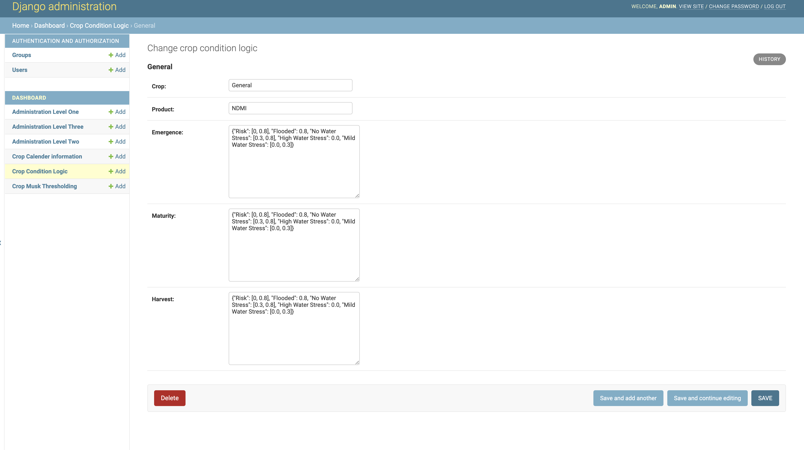

####################
Other Useful Modules 
####################

This section discusses other modules that are available on skyfall backend that aid 
in helping to develop the products.

They include **Crop Musk Thresholding, Crop Condition Logic**

* Crop Musk Thresholding

The crop mask thresholding is a module that helps in creation of crop mask for different
crops for instance maize, or wheat cotton etc. It follows a multi-date thresholding for index 
based crop mask. In some sense, use of NDVI and applying thresholds depending on crop stages thus 
we create a crop mask layer using the threshold.

This can be set using the `dashboard`_ and put custome values 

.. figure:: ../Images/threshold_dash.png
   :alt:

* Crop Condition Logic

This module is integral in computing crop at risk based on the crop stage.

It has Crop and product as character fields while emergence, maturity and harvest as json fields

The Json in the three aforementioned fields, they each contain a key name Risk which has a list inside,
for NDVI the list has one value while for NDMI the list has two values.

This can also be set by `dashboard`_

.. _dashboard: https://skyfall-pipeline.pula.cloud/admin/