###################
Remote Sensing Data 
###################

Hi there this Section of the documentation is to help us understand how to make requests to this API for remotely sensed data from Google Earth engine Api.

base url **https://skyfall-pipeline.pula.cloud/** or use the ip **http://208.85.21.253:8100/** 

Getting Remote Sensing Data 
---------------------------

*This end point it used to give Web Map service Url end point and statistics*

You only need to pass the parameters as follows:

a. platform 

*platform is the parameter that tells the system which satelite instrument we are 
interested in as per writting this documentation Landsat and Sentinel are the available platforms*

if a request is made and the platform parameter is not supplied the system will respond with the valid platfom parameters 
available 

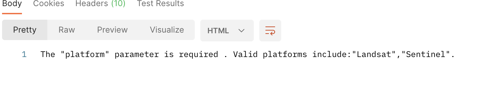

Platforms available

b. sensor

Every satelite has specific sensors mounted for various purposes; and each platfom will have different forms of sensors

    i. Landsat 

Landsat has L8 as the available sensor in this implementation 

*Landsat 8 has a sixteen days revisit time, meaning we can get images after every concsecutive 16 days*

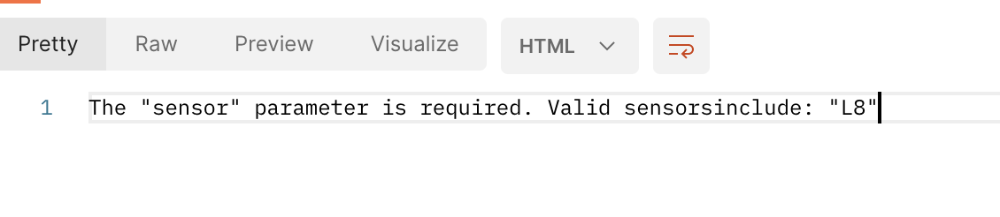

sensors available for Landsat 

    ii. Sentinel 

Sentinel has sentinel_2 in this implementation

*Sentinel 2  a six days revisit time, meaning we can get images after every concsecutive 6 days*

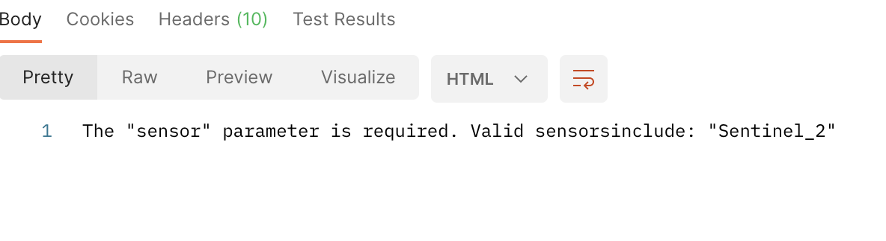

sensors available for Sentinel

c. product

Once we have a sensor selected we use the images to compute products:

    i. Normalized Difference Vegetation Index (NDVI)

It is arrived at by indexing the Near infrared and the red band from a satelite Image,
it is a proxy that informs whether or not Vegetation is healthy.

    ii. Normalized Difference Moisture Index (NDMI)

The product is arrived at by using Near infrared and Short wave infrared bands from a satelite Imagery, 
it is a proxy for estimating whether or not the crop is water stressed.

**Sentinel_2 has the two products (NDVI and NDMI) while L8 has only NDVI as at now**

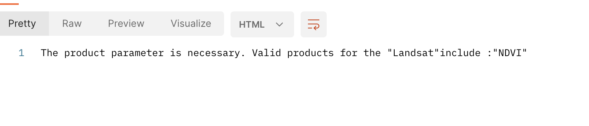

Products available available for L8

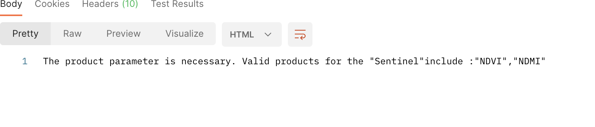

Products available available for sentinel_2

d. geometry

*The geometry parameter is the boundary layer or the are of interest that the satelite image should fall within*

*In this case the feature collection that we obtain from the backend, instead of providing the actual feature collection we 
provide a name of the specific administrative layer and the system will auto generate the feature collection and use it to do the 
analysis from the backend*

* If we need a county we specify a parameter county and supply the name

* If we need a sub-county we specify a parameter sub-county and supply the name

* If we need a ward we specify a parameter ward and supply the name

e. dates 

The dates are used to filter the period within which the satelite images should fall,
in this case the system takes the start date and the end date generates bi-weekly dates that fall within that 
period and computes the long-term median and the bi-weekly products. 

    i. start date 

    ii. end date 

The date parameter can be left blank the system will auto-generate by taking the current date as the end date while,
it calculates 30 days earlier than the current date as the start date

The start date has to be less than the end date otherwise the system will throw an error

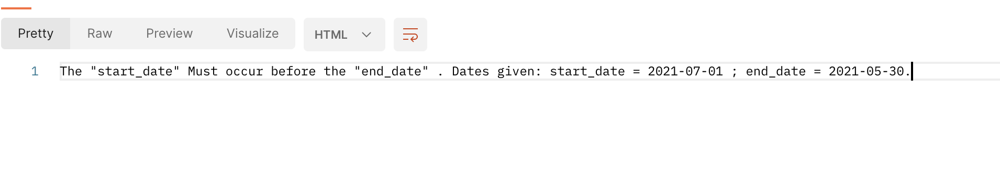

Dates 

Additional info on the current implementation strategy
------------------------------------------------------

Due to some reasons the api has been made alittle more intelligent in the sense that the information being,
retrieved is correlated to a crop a country and a project this is to help the system determine the crop calenda 
information to use, visualization parameters as well as ability to segment crop at risk the module is under active 
development and testing. 

Therefore in this case Additional parameters are neeeded to make this possible this includes 

* country

* crop 

* project

Connecting the Dots 
-------------------

Making the api request for remote_sensing data would be as follows 

a. provide the parameters;

    i. the platfom

    ii. the sensor

    iii. the product

    iv. geometry 

    v. start date 

    vi. end date 

    vii. project

    viii. crop

    ix. country

**Note the geometry will either be county, sub-county, ward or cluster**

*The request is made as follows:* 

* county request

``https://skyfall-pipeline.pula.cloud/RemotesensingApi/get_rsAdmi1/?platform=Sentinel&sensor=Sentinel_2&start_date=2022-08-01&end_date=2022-09-29&crop=Maize&country=Kenya&project=KCEP&county=Bungoma&product=NDVI``

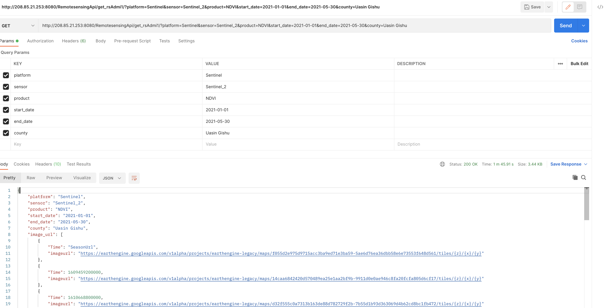

When parameter statistics is passed and set to true the end point returns statistics for the respective product requested;

In this case we get the statistics for NDVI by quering as follows;

``https://skyfall-pipeline.pula.cloud/RemotesensingApi/get_rsAdmi1/?platform=Sentinel&sensor=Sentinel_2&start_date=2022-08-01&end_date=2022-09-29&crop=
Maize&country=Kenya&project=KCEP&county=Bungoma&product=NDVI&statistics=true``

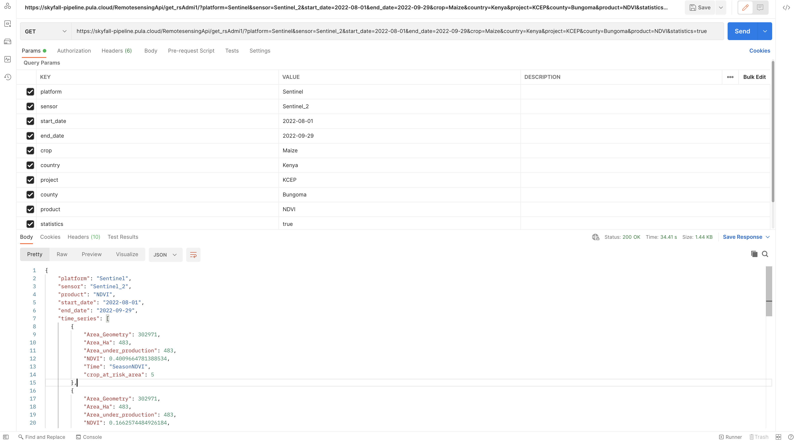

*Another scenario is when we want to get statistics computation for a product in a county but we want this to be done for all clusters that
fall within that respective county. This request can be mades as shown;*

Parameter passed  is **cluster_statistcs_county**

``https://skyfall-pipeline.pula.cloud/RemotesensingApi/get_rsAdmi1/?platform=Sentinel&sensor=Sentinel_2&start_date=2022-08-01
&end_date=2022-09-29&crop=Maize&country=Kenya&project=KCEP&product=NDVI&cluster_statistcs_county=Bungoma``

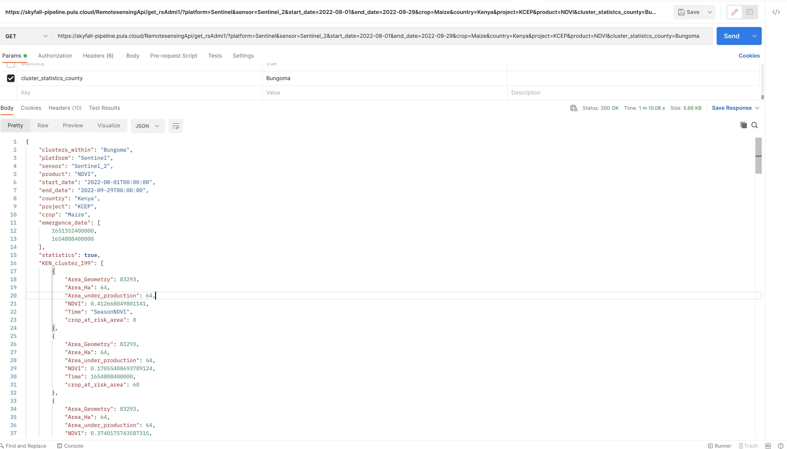

County RS request

* sub-county request 

``https://skyfall-pipeline.pula.cloud/RemotesensingApi/get_rsAdmi1/?platform=Sentinel&sensor=Sentinel_2&start_date
=2022-08-01&end_date=2022-09-29&crop=Maize&country=Kenya&project=KCEP&subcounty=Mogotio&product=NDVI``

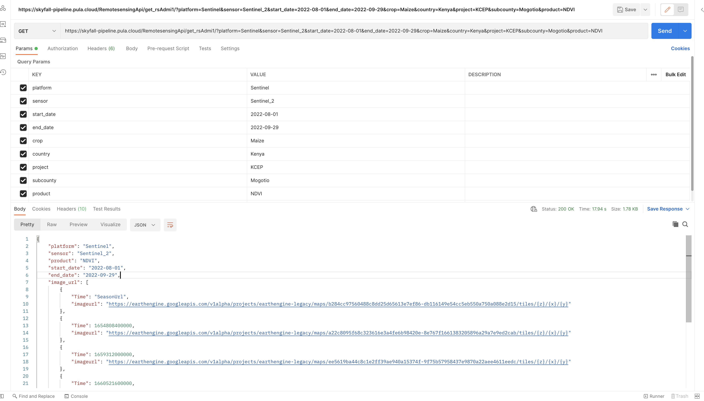

* ward request 

``https://skyfall-pipeline.pula.cloud/RemotesensingApi/get_rsAdmi1/?platform=Sentinel&sensor=Sentinel_2&start_date=2022-08-01
&end_date=2022-09-29&crop=Maize&country=Kenya&project=KCEP&ward=Ngeria&product=NDVI``

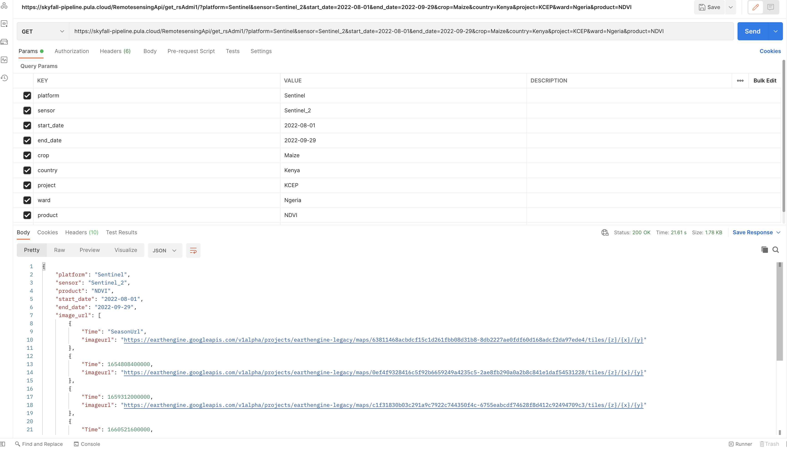

*The response from the api contains, image url which is an object with an array of objects that have 
the time and the image url,it also have time series which is an object with an array of object with time 
and index values (NDVI, NDMI or Flood), the time is in system time stamp* 

